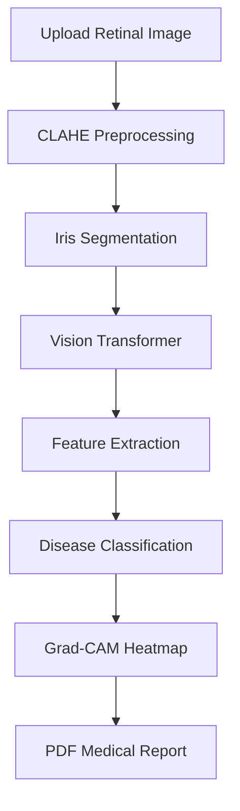

# <div align="center">🌟 LuminaDia</div>

<div align="center">

### AI-Powered Explainable Retinal Disease Detection Platform


<br/>

[](https://us9oehm5frd1vbs7.public.blob.vercel-storage.com/LuminaDia%20_%20XAI-Powered%20Diabetes%20Detection%20-%20Google%20Chrome%202026-05-30%2014-33-09.mp4)

[](https://github.com/savin-ss/luminadia)

</div>

---

# 🖥️ Hero Interface

  <p align="center">
  
</p>
---

# 🚀 Overview

LuminaDia is a next-generation AI healthcare platform designed for non-invasive diabetic retinopathy detection using retinal and iris imaging.

The platform combines:

* 🧠 Vision Transformers (ViT)
* 🔥 Grad-CAM Explainability
* ⚡ Real-time AI Inference
* 📄 AI-generated Medical Reports
* 🎨 Futuristic Medical Dashboard
* 🤖 AI Assistant Integration

to deliver transparent and intelligent medical diagnostics.

---

# ✨ Core Features

<table>
<tr>
<td width="50%">

## 🧠 AI Disease Detection

* Vision Transformer Classification
* Multi-stage DR prediction
* Confidence score analytics
* Real-time AI inference

## 🔍 Explainable AI

* Grad-CAM Heatmaps
* ViT Attention Maps
* AI transparency visualization
* Feature extraction tracking

</td>

<td width="50%">

## 📄 Smart Reporting

* AI PDF Reports
* Scan history
* Medical summaries
* Downloadable diagnostics

## 🎨 Premium UI/UX

* Dark futuristic interface
* Smooth animations
* Glassmorphism effects
* Interactive AI pipeline

</td>
</tr>
</table>

---

# 🎥 Live Demo Video

<p align="center">
  <a href="https://us9oehm5frd1vbs7.public.blob.vercel-storage.com/LuminaDia%20_%20XAI-Powered%20Diabetes%20Detection%20-%20Google%20Chrome%202026-05-30%2014-33-09.mp4">
    
  </a>
</p>

---

# 🔥 AI Analysis Dashboard

  <p align="center">
  
</p>

---

# ⚡ Real-Time AI Pipeline

  <p align="center">
  
</p>

---

# 🧠 AI Workflow



# 🛠️ Tech Stack

## Frontend

* Next.js 15
* React
* TypeScript
* Tailwind CSS
* Framer Motion
* shadcn/ui

## Backend

* FastAPI
* Prisma ORM
* REST API

## AI/ML

* PyTorch
* TensorFlow
* OpenCV
* Vision Transformers
* Grad-CAM
* CNN Architectures

## Database & Deployment

* PostgreSQL
* Firebase / Supabase
* Vercel
* Render
* AWS

---

# 📊 Performance Metrics

| Metric              | Value |
| ------------------- | ----- |
| Validation Accuracy | 99.1% |
| DR Stages Supported | 5     |
| Training Images     | 39K+  |
| Inference Speed     | <5s   |

---

# 📂 Project Structure

```bash
src/
├── app/
├── components/
├── backend/
├── models/
├── animations/
├── hooks/
└── public/
```

---

# 🚀 Installation

```bash
git clone https://github.com/yourusername/luminadia.git
```

```bash
bun install
```

```bash
bun run dev
```

---

# 🌌 Future Improvements

* Multi-disease detection
* AI voice assistant
* Doctor dashboard
* Cloud AI inference
* Mobile app support
* Real-time retinal camera integration

---

# 👨‍💻 Developed By

## SAVIN S S

AI/ML Engineer • Computer Vision • Full Stack Developer

Focused on:

* Healthcare AI
* Explainable AI Systems
* Vision Transformers
* Medical Imaging

---

# ⭐ Support

If you found this project useful:

⭐ Star the repository
🍴 Fork the project
📢 Share with others

---

<div align="center">

### 🚀 Building the Future of Explainable Healthcare AI

</div>
